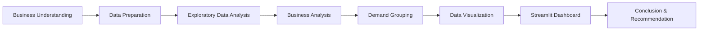

# Bike Sharing Demand Analysis 🚲

## Project Overview

This project analyzes historical bike-sharing data from **2011–2012** to identify rental demand patterns based on time, weather conditions, and user types.

The analysis was performed using **Python**, while the results were presented through an interactive **Streamlit dashboard**. The goal is to provide actionable insights that can support bike allocation, maintenance scheduling, and operational planning.

## Business Questions

1. Which days and hours recorded the highest average bike rentals?
2. How did monthly rental demand change throughout 2012?
3. How did rental demand differ across weather conditions?
4. Which weather factor had the strongest relationship with rental demand?
5. How did rental patterns differ between casual and registered users?
6. Which user segment contributed the largest share of total rentals?
7. How can rental demand be classified into **Low, Medium, and High Demand**?

## Project Workflow



## Data Preparation

Data preparation and analysis were performed using **Python in Google Colab**, including:

- Checking missing values, duplicates, and data types
- Converting numerical categories into descriptive labels
- Denormalizing environmental variables
- Performing exploratory data analysis
- Creating **Low, Medium, and High Demand** groups

## Key Findings

- Rental demand was relatively high during **Wednesday–Friday**.
- The strongest hourly demand occurred around **17:00 - 18:00**.
- Demand was generally higher from **May to September**.
- Clear weather was associated with higher average rental demand.
- **Temperature** showed the strongest positive relationship with rental demand among the analyzed weather factors.
- **Registered users** contributed the majority of total rentals.
- Very low demand during **00:00 - 05:00** provides potential periods for maintenance and bike redistribution.

## Recommendations

- Increase bike availability before peak periods, particularly around **08:00 and 17:00–18:00**.
- Use low-demand hours for maintenance and bike redistribution.
- Prepare additional operational capacity during **May–September**.
- Consider weather conditions when planning daily bike availability.
- Maintain service reliability for registered users while offering incentives to convert frequent casual users into members.

## Tools

- **Python & Pandas** - Data cleaning and analysis
- **Matplotlib, Seaborn & Plotly** - Data visualization
- **Google Colab** - Data preparation and EDA
- **Streamlit** - Interactive dashboard and deployment

## Dashboard

**Live Dashboard:**  
https://bikesharingdemandanalytics.streamlit.app/


## Setup Environment

```bash
cd dashboard
conda create --name bike-sharing python=3.14
conda activate bike-sharing
pip install -r requirements.txt
```

Run the Streamlit application:

```bash
streamlit run app.py
```

## Author

**Muchammad Wildan Alkautsar**
